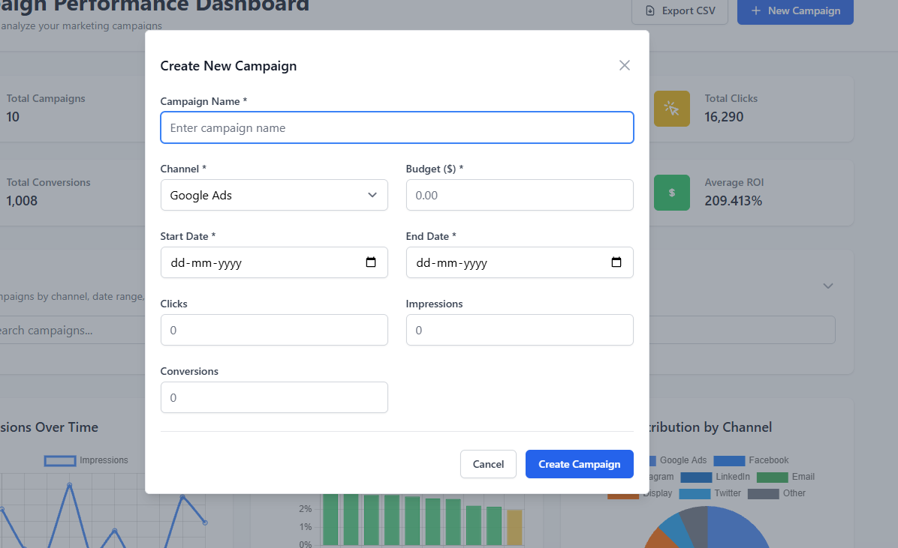
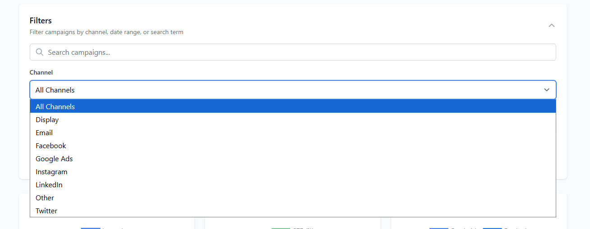
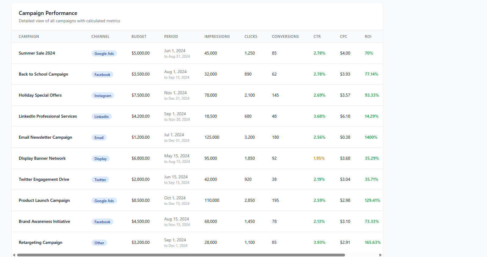

# Campaign Performance Dashboard

A comprehensive MERN stack application for managing and analyzing marketing campaign performance.

## Features

### Frontend (React + TailwindCSS)
- Campaign creation form with validation
- Interactive data table with campaign metrics
- Real-time calculations (CTR, CPC, ROI)
- Advanced filtering by date range and channel
- Interactive charts (Line, Bar, Pie) using Chart.js
- CSV export functionality
- Responsive design

### Backend (Node.js + Express + MongoDB)
- RESTful API for campaign management
- MongoDB integration with Mongoose
- Error handling and validation
- CORS support
- Environment configuration

### Calculated Metrics
- **CTR (Click-Through Rate)**: (clicks / impressions) × 100
- **CPC (Cost Per Click)**: budget / clicks
- **ROI (Return on Investment)**: ((conversions × 100 - budget) / budget) × 100

## Project Structure

```
campaign-dashboard/
├── backend/                 # Express.js API server
│   ├── models/             # Mongoose schemas
│   ├── routes/             # API routes
│   ├── middleware/         # Custom middleware
│   ├── config/             # Database and environment config
│   └── server.js           # Main server file
├── frontend/               # React application
│   ├── src/
│   │   ├── components/     # React components
│   │   ├── pages/          # Page components
│   │   ├── services/       # API services
│   │   ├── utils/          # Utility functions
│   │   └── App.js          # Main App component
│   └── public/             # Static assets
└── README.md
```

## Getting Started

### Prerequisites
- Node.js (v14 or higher)
- MongoDB (local or MongoDB Atlas) - Optional for development
- npm or yarn

### Quick Start

1. **Install all dependencies:**
   ```bash
   npm run install-deps
   ```

2. **Start both servers concurrently:**
   ```bash
   npm run dev
   ```

   This will start:
   - Backend server on http://localhost:5000
   - Frontend server on http://localhost:3000

3. **Open your browser and navigate to:**
   ```
   http://localhost:3000
   ```

### Manual Setup

1. **Install root dependencies:**
   ```bash
   npm install
   ```

2. **Install backend dependencies:**
   ```bash
   cd backend
   npm install
   ```

3. **Install frontend dependencies:**
   ```bash
   cd frontend
   npm install
   ```

4. **Set up environment variables:**

   Backend (`.env` in backend directory):
   ```env
   PORT=5000
   MONGODB_URI=mongodb://localhost:27017/campaign-dashboard
   NODE_ENV=development
   ```

   Frontend (`.env` in frontend directory):
   ```env
   REACT_APP_API_URL=http://localhost:5000/api
   ```

5. **Start the servers separately:**
   ```bash
   # Terminal 1 - Backend (runs on port 5000)
   cd backend
   npm run dev

   # Terminal 2 - Frontend (runs on port 3000)
   cd frontend
   npm start
   ```

### Development Mode

The application includes a mock API service for development, so you can test all features without setting up MongoDB. The mock API provides:
- Sample campaign data
- Full CRUD operations
- Realistic API delays
- Error simulation

## API Endpoints

### Campaign Management
- `POST /api/campaigns` - Create a new campaign
- `GET /api/campaigns` - Get all campaigns
- `GET /api/campaigns/:id` - Get a specific campaign
- `PUT /api/campaigns/:id` - Update a campaign
- `DELETE /api/campaigns/:id` - Delete a campaign

### Filtering and Pagination
- `GET /api/campaigns?channel=X` - Filter campaigns by channel
- `GET /api/campaigns?startDate=X&endDate=Y` - Filter by date range
- `GET /api/campaigns?page=1&limit=10` - Paginate results

### Analytics
- `GET /api/campaigns/analytics/summary` - Get aggregate statistics
- `GET /api/campaigns/analytics/summary?channel=X` - Get channel-specific analytics

### System
- `GET /api/health` - Health check endpoint

## Deployment

### Frontend Deployment (Vercel/Netlify)

1. **Build the frontend:**
   ```bash
   cd frontend
   npm run build
   ```

2. **Deploy to Vercel:**
   ```bash
   npm install -g vercel
   vercel
   ```

   Or to Netlify:
   ```bash
   npm install -g netlify-cli
   netlify deploy
   ```

3. **Set environment variables in the hosting platform:**
   ```
   REACT_APP_API_URL=https://your-backend-api.com/api
   ```

### Backend Deployment (Heroku)

1. **Create a Procfile in the backend directory:**
   ```
   web: node server.js
   ```

2. **Deploy to Heroku:**
   ```bash
   heroku create campaign-dashboard-api
   git subtree push --prefix backend heroku main
   ```

3. **Set environment variables on Heroku:**
   ```bash
   heroku config:set MONGODB_URI=your_mongodb_connection_string
   heroku config:set NODE_ENV=production
   ```

### MongoDB Atlas Setup

1. Create a free MongoDB Atlas account
2. Create a new cluster
3. Set up database access (username/password)
4. Whitelist your IP address or set to allow access from anywhere
5. Get your connection string and add it to your environment variables

## 📸 Screenshots

### Dashboard Overview

*Complete dashboard with statistics cards, interactive charts, and campaign management table*

### Campaign Creation Form

*User-friendly form for creating and editing campaigns with comprehensive validation*

### Interactive Data Visualization

*Real-time charts showing impressions over time, CTR comparison, and budget distribution*

### Advanced Filtering & Search

*Powerful filtering options by channel, date range, and real-time search functionality*

### Campaign Management Table

*Comprehensive table with calculated metrics (CTR, CPC, ROI) and management actions*

## Features Implemented

### ✅ Frontend Features
- **Campaign Management**: Create, edit, delete campaigns with comprehensive form validation
- **Interactive Dashboard**: Real-time statistics cards showing key metrics
- **Advanced Filtering**: Filter by channel, date range, and search campaigns by name
- **Data Visualization**:
  - Line chart for impressions over time
  - Bar chart for CTR comparison
  - Pie chart for budget distribution by channel
- **Data Export**: CSV export functionality with formatted data
- **Responsive Design**: Mobile-friendly interface using TailwindCSS
- **Loading States**: Skeleton loaders and spinners for better UX
- **Error Handling**: User-friendly error messages and validation

### ✅ Backend Features
- **RESTful API**: Complete CRUD operations for campaigns
- **Data Validation**: Mongoose schema validation with custom rules
- **Error Handling**: Centralized error handling middleware
- **CORS Support**: Cross-origin resource sharing enabled
- **Environment Configuration**: Secure environment variable management
- **Database Indexing**: Optimized queries with proper indexing

### ✅ Calculated Metrics
- **CTR (Click-Through Rate)**: (clicks / impressions) × 100
- **CPC (Cost Per Click)**: budget / clicks
- **ROI (Return on Investment)**: ((conversions × 100 - budget) / budget) × 100

### ✅ Additional Features
- **Mock API**: Development-ready mock API with sample data
- **Form Validation**: Client-side and server-side validation
- **Date Range Filtering**: Quick date range selection buttons
- **Search Functionality**: Real-time search with debouncing
- **Pagination Support**: Backend pagination ready for large datasets
- **Analytics Dashboard**: Aggregate statistics and insights

## Technologies Used

- **Frontend**: React 18, TypeScript, TailwindCSS, Chart.js, Axios
- **Backend**: Node.js, Express.js, MongoDB, Mongoose
- **Development**: Nodemon, Concurrently, Create React App
- **Styling**: TailwindCSS with custom components and animations
 