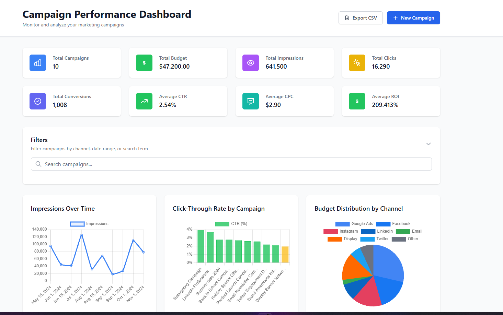
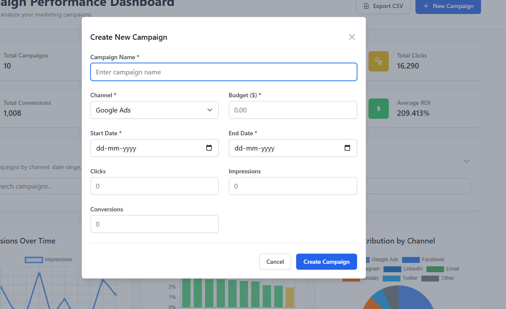
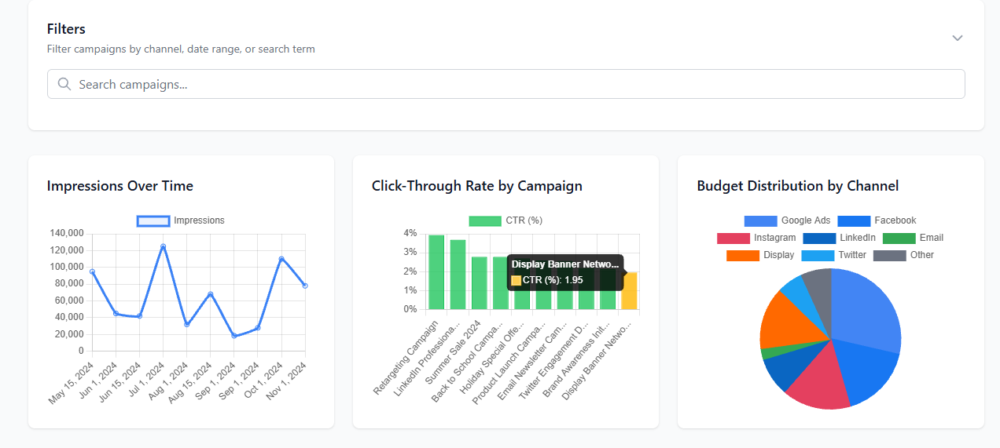
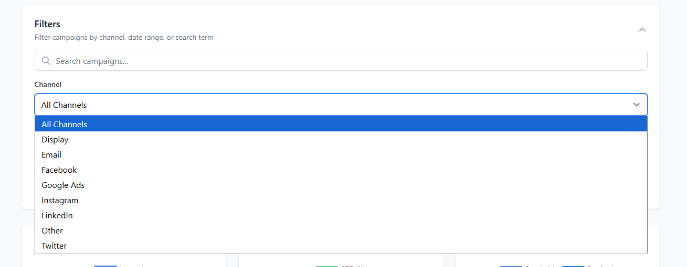
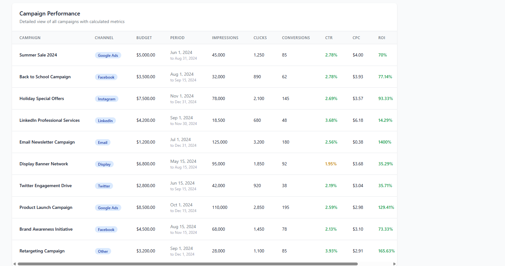

# 📸 Screenshots Guide for Campaign Performance Dashboard

## 🎯 **Screenshots to Take**

### **1. Main Dashboard Overview**
- **File name**: `dashboard-overview.png`
- **What to capture**: Full dashboard with stats cards, charts, and campaign table
- **Browser**: Full screen view
- **Description**: Shows the complete dashboard layout

### **2. Campaign Creation Form**
- **File name**: `campaign-form.png`
- **What to capture**: The modal form for creating/editing campaigns
- **Action**: Click "New Campaign" button first
- **Description**: Shows the form with all input fields

### **3. Interactive Charts**
- **File name**: `charts-section.png`
- **What to capture**: The three charts (Line, Bar, Pie) section
- **Description**: Shows data visualization capabilities

### **4. Filtering and Search**
- **File name**: `filtering-features.png`
- **What to capture**: Filter panel expanded with search and filter options
- **Action**: Click to expand the filters section
- **Description**: Shows advanced filtering capabilities

### **5. Campaign Table with Data**
- **File name**: `campaign-table.png`
- **What to capture**: The data table with campaigns and calculated metrics
- **Description**: Shows campaign management interface

### **6. Mobile Responsive View**
- **File name**: `mobile-view.png`
- **What to capture**: Dashboard on mobile/tablet view
- **Action**: Resize browser to mobile width (375px)
- **Description**: Shows responsive design

## 📋 **Step-by-Step Instructions**

### **Step 1: Take Screenshots**

1. **Open the application** in your browser (http://localhost:3000)
2. **Use these methods to take screenshots:**
   - **Windows**: `Windows + Shift + S` (Snipping Tool)
   - **Mac**: `Cmd + Shift + 4`
   - **Browser Extension**: Use "Full Page Screen Capture" for full page shots

3. **Take each screenshot** following the list above
4. **Save them** in the `screenshots/` folder with the exact names mentioned

### **Step 2: Optimize Screenshots**

- **Resolution**: 1920x1080 or higher
- **Format**: PNG (better quality) or JPG
- **Size**: Keep under 2MB each
- **Quality**: High quality, clear text

### **Step 3: Add Screenshots to Repository**

```bash
# Add screenshots to git
git add screenshots/

# Commit the screenshots
git commit -m "Add project screenshots

- Dashboard overview showing stats and charts
- Campaign creation form interface
- Interactive data visualization charts
- Advanced filtering and search features
- Campaign management table
- Mobile responsive design view"

# Push to GitHub
git push origin main
```

## 📝 **Update README.md with Screenshots**

Add this section to your README.md after the "Features" section:

```markdown
## 📸 Screenshots

### Dashboard Overview

*Complete dashboard with statistics cards, interactive charts, and campaign management table*

### Campaign Creation Form

*User-friendly form for creating and editing campaigns with validation*

### Interactive Data Visualization

*Real-time charts showing impressions, CTR comparison, and budget distribution*

### Advanced Filtering

*Powerful filtering options by channel, date range, and search functionality*

### Campaign Management Table

*Comprehensive table with calculated metrics (CTR, CPC, ROI) and management actions*

### Mobile Responsive Design

*Fully responsive design optimized for all device sizes*
```

## 🎨 **Pro Tips for Better Screenshots**

### **Before Taking Screenshots:**
1. **Clear browser cache** and reload
2. **Use incognito/private mode** for clean interface
3. **Zoom to 100%** for crisp images
4. **Hide browser bookmarks bar** for cleaner look
5. **Use sample data** (already included in the app)

### **What to Highlight:**
- ✅ **Interactive elements** (buttons, forms, charts)
- ✅ **Data visualization** (charts with data)
- ✅ **Responsive design** (mobile view)
- ✅ **User interface** (clean, professional look)
- ✅ **Functionality** (filters, search, CRUD operations)

### **Screenshot Composition:**
- **Full browser window** for main views
- **Focused sections** for specific features
- **Before/after states** (e.g., form empty vs filled)
- **Hover states** if possible (tooltips, buttons)

## 🚀 **Alternative: Use GitHub's Web Interface**

If you prefer, you can also:
1. **Upload screenshots directly** to GitHub web interface
2. **Drag and drop** images into the repository
3. **Edit README.md** directly on GitHub to add image links

## 📊 **Recommended Screenshot Sizes**

- **Desktop**: 1920x1080 (Full HD)
- **Tablet**: 1024x768
- **Mobile**: 375x667 (iPhone size)
- **File size**: Under 2MB each
- **Total**: Aim for 6-8 high-quality screenshots

## ✅ **Checklist**

- [ ] Dashboard overview screenshot
- [ ] Campaign form screenshot  
- [ ] Charts section screenshot
- [ ] Filtering features screenshot
- [ ] Campaign table screenshot
- [ ] Mobile responsive screenshot
- [ ] Screenshots added to git
- [ ] README.md updated with images
- [ ] Changes pushed to GitHub

**After completing this, your GitHub repository will look much more professional and attractive to visitors!** 🌟
